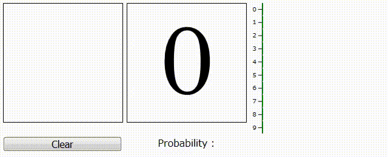

# Digit Recognition WebApp, PyTorch, Flask

**Demo Site : https://digit-recog-torch.uc.r.appspot.com/**

## Specific

### Neural Network

- 2xCNN layers, Batch Normalization, Adam Optimizer
- using MNIST data
- centering input digit for better recognition
- 99.3% of accuracy at validation

### Web Application

- using Flask for web framework
- using d3.js for drawing bar graph

## Requirements
- `pip install -r requirements.txt`
- tested on Python 3.7, pytorch 1.7.1, CUDA 11.2

## Usage

- #### Run WebApp
  `python3 server.py`   
  ->then access to `localhost:5000`
  
- #### Training Model
  cpu training: `python3 train.py`

  gpu training: `python3 train.py --use_gpu` (enabled when gpu and cuda is available)

